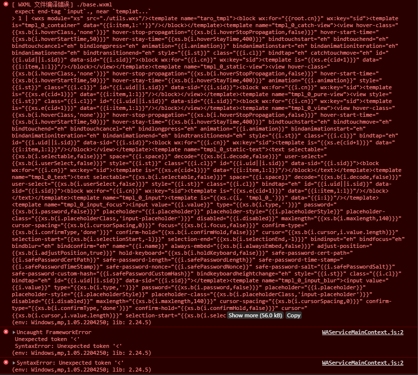

# 安装

```
yarn install
```

# 操作步骤

## 复现bug

1. 更改`config/index.js`配置项，`config>mini>minifyXML>collapseWhitespace`：`true`
2. `src/pages/index/idnex.vue`, 新增一个input标签
3. 重新运行项目，并返回微信开发工具，开发工具报错


## 消除bug

把配置项配置为false，就正常了
`config>mini>minifyXML>collapseWhitespace`：`false`
